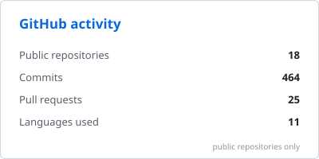
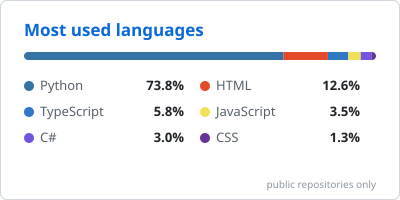

# Hi, I'm Kerem 👋

I build software for robotics teams, student organisations and my own AI experiments. Most of what I make ends up in front of real users: a scouting app used at FRC events, websites for the clubs I'm part of, and models I fine-tune and serve myself.

- 🔭 **Working on:** software for [Golden Horn FRC 8159](https://goldenhorn-rho.vercel.app) and WeCampus, plus Conrad, an autonomy stack for underwater inspection robots
- 🌱 **Learning:** fine-tuning and serving small open models (LoRA, MLX, llama.cpp), robot perception and simulation
- 🤖 **Into:** FIRST Robotics (FRC and FTC), machine learning, Model UN, and design for print and the web
- 👯 **Open to:** collaborating on robotics software, student-run projects and open-source AI tooling

## 🛠️ Projects

| Project | What it is | Built with |
| --- | --- | --- |
| [**Kale Forge**](https://github.com/keremtuzun/kale-forge) | Self-hosted AI design review for PCBs and FRC robots, running on my own LoRA fine-tune of an open-weight model. No external AI APIs. | Python, TypeScript, Docker |
| [**Conrad V2**](https://github.com/keremtuzun/conrad-v2) · [ROV Digital Twin](https://github.com/keremtuzun/rov-digital-twin) | Autonomy and evaluation stack for underwater inspection robots, with separate truth, belief and decision planes. Simulation stage for now. | Python, Unity, PyTorch |
| [**Golden Horn Scouting**](https://github.com/keremtuzun/goldenhorn) | Match scouting platform for FRC team 8159. [Live](https://goldenhorn-rho.vercel.app) | JavaScript, Supabase |
| [**RAMs 7729 site**](https://github.com/keremtuzun/Rams7729) | Website for FRC team 7729. [Live](https://frcrams.com) | Next.js, TypeScript |
| [**SponsorPilot**](https://github.com/keremtuzun/sponsorpilot) | An AI sponsorship broker for student clubs: finds sponsors, writes the pitch and negotiates. Built for the Build with Gemini XPRIZE hackathon. | Next.js, Gemini API |
| [**Art4Good**](https://github.com/keremtuzun/art4good) | Bilingual site for a student-led initiative bringing art workshops to primary-school kids in Istanbul. [Live](https://art4good.vercel.app) | Next.js, Framer Motion |
| [**Science & Tech Voices**](https://github.com/keremtuzun/Science-and-Tech-Voices) | Weekly science and technology explainers. [Live](https://science-and-tech-voices.vercel.app) | HTML, CSS, JavaScript |
| [**Mechanical failure prediction**](https://github.com/keremtuzun/ML) | Predictive maintenance pipeline that flags machines likely to fail from sensor readings. | Python, scikit-learn |

## 🧰 Tech stack

  

## 📊 GitHub stats

  
  

## 📫 Find my work

  
  
  

Stats cards are regenerated daily by a GitHub Action in this repo and count public repositories only.
